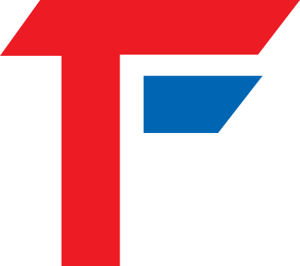
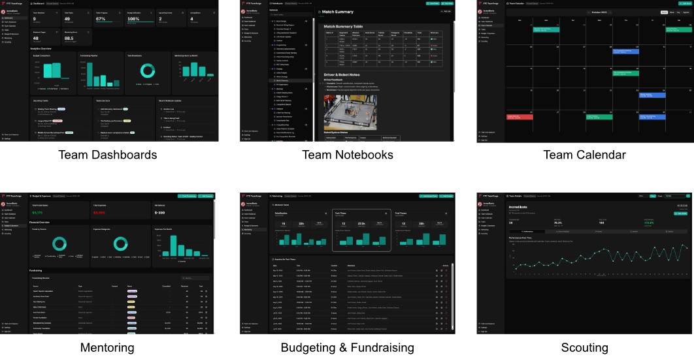

  
  <h1>FTC TeamForge</h1>
  
A comprehensive web application designed specifically for FIRST Tech Challenge (FTC) robotics teams to manage their entire season workflow, from engineering design collaboration to competition tracking.

  

    <a href="https://www.ftcteamforge.com/">Official Website</a> •
    <a href="https://www.ftcteamforge.com/docs/getting-started/introduction">Getting Started</a> •
    <a href="https://www.ftcteamforge.com/videos">How-to Videos</a>
  

  

## Overview

FTC TeamForge is a season-based team management platform that provides all the tools needed to run a successful FTC robotics team. Built with modern web technologies and optimized for both desktop and mobile use, it supports the unique workflows and documentation requirements of FIRST Tech Challenge teams.

## Key Features

### 🏠 **Dashboard Overview**

- Season-specific metrics and KPIs with visual charts
- Financial overview with budget tracking
- Task breakdown and progress tracking
- Mentoring hours analytics
- Upcoming events and tasks due soon
- Recent notebook updates

### 📚 **Team Notebook**

- Rich BlockNote editor with Notion-like experience
- Folder-based organization with color coding
- Entity-linked notebook pages (tasks, events, mentoring sessions)
- Search functionality across all notes
- Season-specific notebook organization
- Real-time saving with offline support

### 📋 **Task Management**

- Kanban-style board (To Do, In Progress, Done)
- Task categories (outreach, mentoring, fundraising, robot building, programming, documentation)
- Multi-assignee support
- Due dates and tracking
- Linked notebook pages for task documentation

### 📅 **Team Calendar & Events**

- Full calendar view (month, week, day, agenda)
- Event types (meetings, competitions, outreach, workshops, social)
- RSVP system and attendee tracking
- Recurring events support
- Location and time tracking
- Linked notebook pages for event documentation

### 💰 **Budget & Fundraising**

- Expense tracking with categories
- Fundraising opportunity management
- Budget utilization charts
- Fundraising pipeline visualization
- Financial reporting and analytics

### 👨‍🏫 **Mentoring Module**

- Mentored team management
- Mentoring session tracking with time logs
- Session scheduling with attendee tracking
- Hours logging and analytics by month
- Linked notebook pages for session notes

### 🔍 **Scouting System**

- FTC Events API integration
- Team search and information lookup
- Event search and team rosters
- Match history and awards tracking
- Linked notebook pages for scouting notes

### 👥 **Team Management**

- Team member profiles and roles
- Role-based permissions (Admin, Mentor, Student, Guest)
- Invite link system with customizable codes
- Add members directly or via shareable invite links
- Multi-season support with season switching
- Team settings (name, logo, location)

### ⚙️ **User Settings**

- Profile management (name, email)
- Theme customization (light, dark, system)
- Accent color selection
- Password management

## Getting Started

For detailed installation and setup instructions, please visit our [Getting Started Guide](https://www.ftcteamforge.com/docs/getting-started/introduction).

## Contributing

This application is designed for FTC teams and welcomes contributions from the FIRST community.

Interested in contributing to the project? Reach out to us at **incredibotsftc@gmail.com** and we'll be happy to discuss how you can help!

## License

This project is licensed under the **GNU Affero General Public License v3.0 (AGPL-3.0)**.

### What This Means for FTC Teams:

- ✅ **Free to use** - Use FTC TeamForge for your team at no cost
- ✅ **Free to modify** - Customize the platform for your team's needs
- ✅ **Share improvements** - Non-team-specific enhancements should be contributed back to benefit the FTC community
- ❌ **No commercial use** - Cannot sell or commercialize this software
- 📋 **Open source required** - If you host a modified version publicly, you must share your source code

This ensures FTC TeamForge remains free and open for all FIRST Tech Challenge teams while preventing commercial exploitation.

For full license details, see [LICENSE.md](LICENSE.md).

This project follows the values and guidelines of the FIRST organization.

## Get In Touch

**Interested in contributing or learning how this app was built using AI?**

This entire application was developed 100% using AI-assisted programming. If you're curious about our development process, want to contribute to the project, or need help getting started with FTC TeamForge:

📧 **Email:** incredibotsftc@gmail.com
🌐 **Website:** [www.theincredibots.com](https://www.theincredibots.com)
📸 **Instagram:** [@ftc26336](https://www.instagram.com/ftc26336)

---

*Built with ❤️ for the FIRST Tech Challenge community by Team Incredibots (#26336)*
